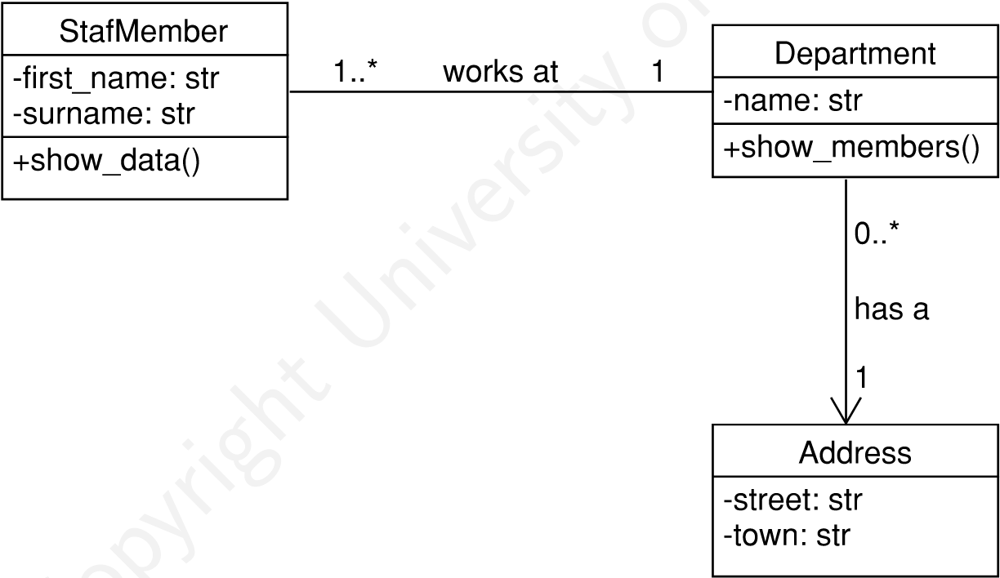

# Object-Orientation

## Table of Contents  

## 1. Class

### 1.1. Classes and Objects

- **Object**: a representation of a "thing", often from the real world (anthropomorphism) with specific characteristics
- **Class**: group objects with the same characteristics: attributes (data), and operations (behaviour). An object is and is an *instance* of a class
- **Hint**: "Car" is a class, **a** car is an instance/object
- **Informational cohesion: data belongs to one object, which data is determined by the class
- **Anthropomorphism**: a class often represents a thing of the real world, the attributes and properties of that thing
- Remark
  - Use the Python notation in illustrating UML diagrams
  - A constructor is necessary in Python

### 1.2. Classes with attributes in Python

- Keyword **class** with name of class
  - Recommended **naming convention**: PascalCase: e.g. ***class*** **Patient** or ***class*** **PatientFile**
- **Object attributes** (also: **instance-attributes**): e.g. ***self***.weight
  - Recommended naming convention: snake_case
  - ***self*** refers to the **instance**, not the class
  - Most program languages define attributes on class level
  - In Python: only initialized in the ***constructor*** method of a class. During object creation, the constructor method will be called automatically. Class attributes in Python are static

  

#### Example Python: Patient

File: patient.py

```python
class Patient:
    def __init__(self, new_name, new_length, new_weight):
        # Declaration/initialization object attributes
        self.name = new_name
        self.length = new_length
        self.weight = new_weight

# Instaces/objects
jan = Patient("Jan De Vos", 1.75, 70.0)
peter = Patient("Peter Martens", 1.9, 92.5)

print("Weight of Peter:", peter.weight) # peter.weight: read object attribute

bmi = round(jan.weight / jan.length ** 2, 1)
print("The BMI of Jan De Vos is:", bmi)

bmi = round(peter.weight / peter.length ** 2, 1)
print("The BMI of Peter Martens is:", bmi)
```

```cmd
Weight of Peter: 92.5
The BMI of Jan De Vos is: 22.9
The BMI of PTer Martens is: 25.6
```

### 1.3. Memory Storage

- **Classes in memory**: reference to methods, in Python: **Patient.*****\_\_init\_\_***:
  - Class Patient has a unique id **94622088064944** (points to memory location)
  ```python
  {
    '__module__': '__main__', '__init__': <function Patient.__init__ at 0x7fa21235e4d0>,
  }
  ```

- **Object (instance) in memory**: storage of object attributes (data):
  - *Objects* "jan" and "peter", *instances of class* Patient, both with ***unique ids***

- Tip: use **\_\_dict\_\_** to visualise (data and methods), e.g. Patient.\_\_dict\_\_, jan.\_\_dict\_\_ and peter.\_\_dict\_\_

#### Excersise: products

A shop wants to manage its products.

- Create a class to keep the following information about products: article number, name, description, price, stock
- Read the file "products.csv", and create an object for every product
- Save the products in a list
- Show for every products: article number, name, price, and total stock value

#### Solution:

```python
import csv

class Product:
    def __init__(self,article_number, name, description, price, stock):
        self.article_number = article_number
        self.name = name
        self.description = description
        self.price = price
        self.stock = stock

products =[]

with open('product.csv', encoding='utf-8-sig', newline='') as csvfile:
    for row in csv.DictReader(csvfile):
        product = Product(row['article_number'], row['name'], row['description'], float(row['price']), int(row['stock']))
        products.append(product)

for product in products:
    print(product.article_number, product.name, product.price, "value:", product.price * product.stock)
```

### 1.4. Visibility

- **Principle**: external modules/classes are not allowed to access attributes of a class
- Three level of visibility:
  - **Public**: attributes can be accessed/changed ***without restriction*** (see previous example)
  - **Private**: attributes are only accessible ***from within the class***
  - **Projected**: attributes are accessible ***from within the class and subclasses*** (not applicable in these seminars)
- The same is applicable to methods
- UML notation: **+** for public, **-** for private, and **#** for protected

### 1.5. Encapsulation/information hidding in Python

- Getters and setters: public methods to read and write attributes
  | Traditional way                   | Python way                                                  |
  |-----------------------------------|-------------------------------------------------------------|
  |```def get_weight(self)```         | ```@property``` <br /> ```def weight(self)```               |
  |```def set_weight(self, weight)``` | ```@gewicht.setter``` <br /> ```def weight(self, weight)``` |

- We use verbs *get* and *set*, but the choice is free
- ```@property``` and ```@gewicht.setter``` are so called *decorators* that declare a "property" (read and write)

#### Getters and setters: example in UML


#### Getters and setters: example P13 (Python way)

File: patient.py

```python
class Patient:
    def __init__(self, new_name, new_length, new_weight):
        self.__name = new_name
        self.__length = new_length
        self.__weight = new_weight

    @property # Property - definition
    def weight(self):
        return self.__weight
    
    @weight.setter # Property setter - definition
    def weight(self, weight):
        self.__weight = weight

    # Other getters and setters...

peter = Patient("Peter Martens", 1.90, 92.5)
peter.weight = 94 # Property setter - call
print("Peter weighs", peter.weight, "kg") # Property - call
```

```cmd
Peter weighs 94 kg
```

- It seems we approach an attribute ==> but in reality, methods are being called

#### Excercise P14: products

A shop wants to consult the stock of its products.

- Create a class to keep the following attributes:
  - article number
  - name
  - description
  - price (float)
  - stock (round number)
- Use encapsulation according to the Python way
- Read the file "products.csv", and create an object for each product
- Show for each product: article number, name, price, and total stock value, in tabular form (use 'tabulate')
- Create a separate function for eading data and showing the result (+/- IVO)

##### Solution

```python
import csv

from tabulate import tabulate


class Product:
    def __init__(self, article_number, name, description, price, stock):
        self.__article_number = article_number
        self.__name = name
        self.__description = description
        self.__price = price
        self.__stock = stock
    
    @property
    def article_number(self):
        return self.__article_number
    
    @property
    def name(self):
        return self.__name
    
    @property
    def description(self):
        return self.__description
    
    @property
    def price(self):
        return self.__price
    
    @property
    def stock(self):
        return self.__stock
    
    def total_value(self):
        return self.__price * self.__stock


def read_products():
    products = []
    with open('product.csv', encoding='utf-8-sig', newline='') as csvfile:
        for rij in csv.DictReader(csvfile):
            product = Product(rij['article_number'], rij['name'], rij['description'], float(rij['price']), int(rij['stock']))
            products.append(product)
        return products
    
def show_products(products):
    product_table = []
    for product in products:
        product_table.append([product.article_number, product.name, product.price, product.total_value()])
    
    print(tabulate(product_table, headers=['Article number', 'Name', 'Price', 'Total value']))

products = read_products()
show_products(products)
```

```cmd

```

### 1.6. Full Object-orientation: class = data + operations

- Keyword **class** with class name --> e.g. **class** ***Patient***
- Object attributes: e.g. **self**.weight
- **Methods**: e.g. **def** ***Patient***.show_bmi(**self**)
  - A method is a function but belongs to a class
  - A method can access object attributes directly, thus there is no need for parameters for these attributes
  - In PYthon: the first parameter **self** is necessary to read or change object attributes

#### Example: Full Object-orientation

```python
class Patient:
    def __init__(self, new_name, new_length, new_weight):
        self.name = new_name
        self.length = new_length
        self.weight = new_weight

    def show_bmi(self): # Method of class - definition
        bmi = self.weight / self.length ** 2
        print("The BMI of", self.name, " is:", round(bmi, 2))

jan = Patient("Jan De Vos", 1.75, 70.0)
peter = Patient("Peter Martens", 1.90, 92.5)

jan.show_bmi() # Method of class - call: self = objecct (jan or peter)
peter.show_bmi() # Method of class - call
```

```cmd
The BMI of Jan De Vos  is: 22.86
The BMI of Peter Martens  is: 25.62
```

#### Example: Private Methods

```python
class Patient:
    def __init__(self, new_name, new_length, new_weight):
        self.name = new_name
        self.length = new_length
        self.weight = new_weight

    def calculate_bmi(self): # Private Method - cannot be called from outside
        return self.weight / self.length ** 2

    def show_bmi(self):
        print("The BMI of", self.name, " is:", round(self.calculate_bmi(), 2))

jan = Patient("Jan De Vos", 1.75, 70.0)
peter = Patient("Peter Martens", 1.90, 92.5)

jan.show_bmi() 
peter.show_bmi() 
```

```cmd
The BMI of Jan De Vos  is: 22.86
The BMI of Peter Martens  is: 25.62
```

#### Excercise: Bank Account

Design a class for a bank account:
- An account is created with an account number.
- The account number can be consulted.
- Save for every account the present balance, consultable.
- The balance should be modifiable during a debit or credit.
- Define a limit amount per account, which is what can be withdrawn maximally in one transaction.
- An amount higher than the limit cannot be withdrawn.
- Create two accounts, make some  transactions (debit/credit) and print the closing balance.

##### Solution: Bank Account


```python
class Account:
    def __init__(self, account_number): # constructor
        self.__acount_number = account_number # private
        self.__balance = 0
        self.__limit = 0
    
    @property
    def blance(self):
        return self.__balance
    
    @property
    def account_number(self):
        return self.__acount_number
    
    @property
    def limit(self):
        return self.__limit
    
    @limit.setter
    def limi(self, limit):
        self.__limit = limit

    def bebet(self, amount):
        if amount > self.__limit:
            return # could be a check here, control coupling type 2
        self.__balance -= amount

    def credit(self, amount):
        self.__balance += amount


account_johan = Account("BE32 4857 8126 7302")
account_johan.credit(3540)
account_karel = Account("BE62 8974 2975 6861")
account_karel.credit(327.43)

account_johan.debet(245.45)
account_johan.credit(1200)

account_karel.debet(250.82)
account_karel.credit(240.01)
account_karel.debet(56)

print("Johan van de Genechte:", account_johan.balance)
print("Karel Meenaerts:", account_karel.balance)
```

```cmd
Johan van de Genchte: 4740.0
Karel Meenaerts: 567.44
```

#### Excercise P27: Inheritance: Second-hand Dealer

- Create in Python a class "Car" without inheritance
  - Leave out getters and setters
  - Ad a constructor. Those are not mentioned on the UML diagram for space saving reason.
- Create in Python an inheritance structure.
  - Leave out getters and setters
  - Ad a constructor. Those are not mentioned on the UML diagram for space saving reasons.
  - The superclass inherits from Python class 'ABC' of module 'abc'.


##### Solution 1: Example class Car

```python
class Car:
    def __init__(self, year, brand, model, colour, kilometres, asking_price):
        self.year = year
        self.brand = brand
        self.model = model
        self.colour = colour
        self.kilometres = kilometres
        self.asking_price = asking_price
```
- Attributes, getters, setters, and other methods are missing here

##### Solution 2: Inheritance: Second-hand Dealer

```python
from abc import ABC # abstract class

class Vehicle(ABC): # inheritance of ABC renders this class abstract
    def __init__(self, year, brand, model, kilometres, asking_price):
        pass

class Van(Vehicle):
    def __init__(self, year, brand, model, kilometres, asking_price, payload):
        super().__init__(year, brand, model, kilometres, asking_price)

class Car(Vehicle):
    def __init__(self, year, brand, model, kilometres, asking_price, colour, seats):
        super().__init__(year, brand, model, kilometres, asking_price)

class Truck(Vehicle):
    def __init__(self, year, brand, model, kilometres, asking_price, axes):
        super().__init__(year, brand, model, kilometres, asking_price)
```

- Subclass constructors call superclass constructor
- Getters, setters, and other methods are missing here

## 2. Associations

### 2.1. What is an association

- **"A relationship between 2 classes"**
- An association:
  - has a name
  - has multiplicities
  - can have roles (optional)


#### Example: Association - Python

```python
class Department:
    def __init__(self, name):
        self.members = [] # relation
        self.name = name
    
    # getters and setters
        
    def add_staff_member(self, member):
        self.members.append(member)

    def show_members(self):
        pass

class StaffMember:
    def __init__(self, department, first_name, surname):
        self.__department = department # relation
        self.__department.add_staff_member(self) # relation
        self.__firstname = first_name
        self.__surname = surname

    def show_data(self):
        pass

departmentMKT = Department("Marketing")
jozef = StaffMember(departmentMKT, "Jozef", "Goossens")
peter = StaffMember(departmentMKT, "Peter", "De Grootte")
```

##### Explanation

- A **link attribute** is a reference to the object or objects at the other side of the association --> enables navigation
  - Example: __department refers to the department of the staff member
  - Objects will always be stored by reference (*mutable*): if someone changes attributes of this department, it's visible when we read the department via a staff member
- **Association management methods** take care of *filling* in the link attribute with a reference to one object, or *add* of *remove* references in a list/dictionary (e.g. *add_xxx* of *remove_xxx*)
  - **Remark**: setters can exist in use cases where associations can change after initialisation, e.g. change of department

### 2.2. Navigability

- Default: bidirectional
- Constraints are indicated by an arrowhead



#### Exercise: implement this in Python

```python
class Adress:
    def __init__(self, street, town):
        self.__street = street
        self.__town = town

class Department:
    def __init__(self, address, name):
        self.menbers = [] # relation
        self.__adrdress = address # relation
        self.__name = name
    
    # getters and setters
        
    def add_member(self, member):
        self.members.append(member)
    
    def show_members(self):
        pass

class StaffMember:
    def __init__(self, department, first_name, surname):
        self.__department = department # relation
        self.__department.add_member(self) # relation
        self.__first_name = first_name
        self.__surname = surname
    
    # getters and setters
        
    def show_data(self):
        pass

adressTAC = Adress("Grote markt 32", "Antwerpen")
departmentMKT = Department(adressTAC, "Marketing")
jozef = StaffMember(departmentMKT, "Jozef", "Goosens")
```

### 2.3. Many-to-Many with Association Class


### 2.4. Replace Association Class with Class


#### Extended Example: Second-hand Dealer


#### Exercise P41: One-to-One Association


- Objects of both classes refer to an object of the other class (bidirectional navigability)
- The reference "company_car" in an "Employee" object can be empty
- Association defines references --> link attributes not in UML
- **Question**: write the Python code for this model

```python
class Employee:
    def __init__(self, number, first_name, surname):
        self.__number = number
        self.__first_name = first_name
        self.__surname = surname
        #-------------------------------------------
        self.__company_car = None # relation - link attribute
        #-------------------------------------------

    @property
    def number(self):
        return self.__number
    
    @property
    def first_name(self):
        return self.__first_name
    
    @property
    def surname(self):
        return self.__surname
    
    @first_name.setter
    def first_name(self, first_name):
        self.__first_name = first_name

    @surname.setter
    def surname(self, surname):
        self.__surname = surname

    @property
    def naam(self):
        return self.__first_name + " " + self.__surname

    #-----------------------------------------------------
    @property # Association management methods
    def company_car(self):
        return self.company_car
    
    @company_car.setter # Association management methods
    def company_car(self, company_car):
        self.__company_car = company_car
    #-----------------------------------------------------

class CompanyCar:
    def __init__(self, registration, license_plate, employee):
        self.__registration = registration
        self.__license_plate = license_plate
        #-------------------------------------------
        self.__employee = employee # relation - Link attribute
        employee.company_car = self # relation - Link attribute (set value)
        #-------------------------------------------

    @property
    def registration(self):
        return self.__registration
    
    @property
    def license_plate(self):
        return self.__license_plate
    
    @license_plate.setter
    def license_plate(self, new_license_plate):
        self.__license_plate = new_license_plate

    #-----------------------------------------------------
    @property # Association management methods
    def employee(self):
        return self.__employee
    
    @employee.setter # Association management methods
    def employee(self, employee):
        self.__employee = employee
        employee.company_car = self
    #-----------------------------------------------------
```

##### Remark

- The **link attribute** is immediately registered via the constructor. Why? A company car is this universe of discussion is *always* assigned to an employee
- The **association management method** ```def company(self, company_car)``` allows the assignment of another company car to an employee

#### Exercise P45: One-to-many association: Personnel (UML) - Bidirectional associations


```python
import models_da

class Employee:
    def __init__(self, number, first_name, surname, birth_date, department): # department: call by object reference
        self.__number = number
        self.__first_name = first_name
        self.__surname = surname
        self.__birth_date = birth_date
        #-------------------------------------------
        self.__department = department # relation - link attribute
        #-------------------------------------------

    @property
    def number(self):
        return self.__number
    
    @property
    def first_name(self):
        return self.__first_name
    
    @property
    def surname(self):
        return self.__surname
    
    @property
    def birth_date(self):
        return self.__birth_date

    @first_name.setter
    def first_name(self, first_name):
        self.__first_name = first_name

    @surname.setter
    def surname(self, surname):
        self.__surname = surname

    @birth_date.setter
    def birth_date(self, birth_date):
        self.__birth_date = birth_date

     #-----------------------------------------------------
    @property # Association management methods
    def department(self):
        return self.__department
    
    @department.setter # Association management methods
    def department(self, department):
        self.__department = department
     #-----------------------------------------------------

class Department:
    def __init__(self, number, name):
        self.__number = number
        self.__name = name
        #-------------------------------------------
        self.__employees = None # relation - link attribute
        #-------------------------------------------

    @property
    def number(self):
        return self.__number
    
    @property
    def name(self):
        return self.__name
    
    @name.setter
    def name(self, name):
        self.__name = name

     #-Lazy loading----------------------------------------------------
    @property # Association management methods
    def employees(self):
        if self.__employees is None:
            self.employees = models_da.EmployeeDA().find_by_department(self)
    
    def add_employee(self, employee): # Association management methods
        self.__employees.append(employee)

    def remove_employee(self, employee): # Association management methods
        self.__employees.remove(employee)
     #-----------------------------------------------------
```

#### Exercise P48: Many-to-many associations: films (UML)


